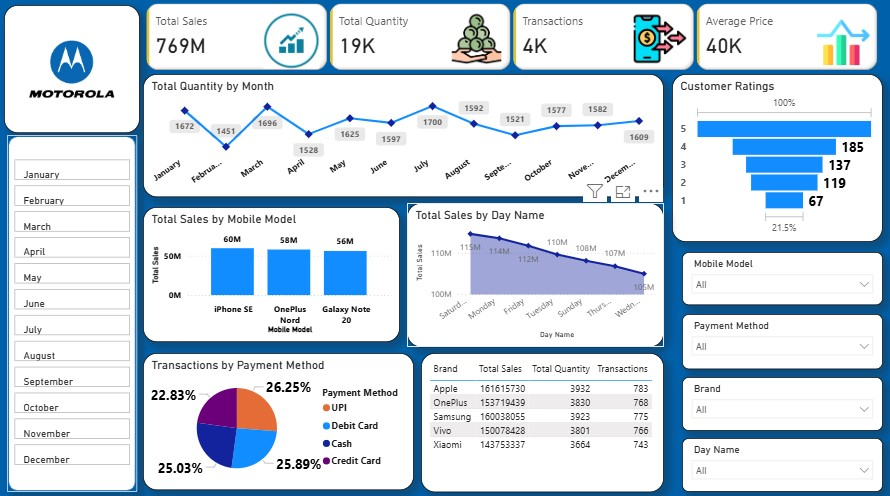

# Mobile Sales Power BI Dashboard

## 📊 Project Overview
This project presents a **Mobile Sales Data Dashboard** developed using **Microsoft Power BI**.  
The dashboard provides interactive and insightful analysis of mobile sales performance across different brands, models, payment methods, and time periods.

## 🎯 Key Insights
- Total Sales, Total Quantity, Transactions & Average Price
- Monthly sales trend analysis
- Sales comparison by mobile model
- Brand-wise sales, quantity, and transactions
- Customer ratings distribution
- Transactions by payment method
- Day-wise sales performance

## 🛠 Tools & Technologies
- Microsoft Power BI
- DAX (Data Analysis Expressions)
- Data Modeling
- Interactive Slicers & Filters
- Data Visualization

## 🖼 Dashboard Preview

## 🎥 Dashboard Screen Recording
Watch the dashboard walkthrough to see interactive filters, slicers, and dynamic visuals in action:

🔗 **[Watch Dashboard Screen Recording][Dashboard.mp4]

## 📂 Project Files
- `Mobile_Sales_PowerBI_Dashboard.pbix` – Power BI dashboard file  
- `dashboard.png` – Dashboard screenshot  
- 🎥 Screen Recording – Linked above  

## 📚 Learning Source
This dashboard was created as part of my learning journey from **Skill Course**, under the guidance of **Satish Dhawale**.

## 🚀 Conclusion
This project helped me strengthen my Power BI skills and gain hands-on experience in transforming raw sales data into meaningful business insights through interactive dashboards.
